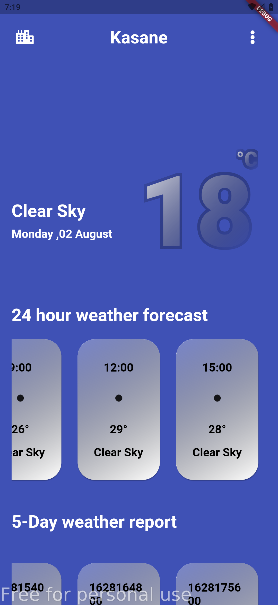
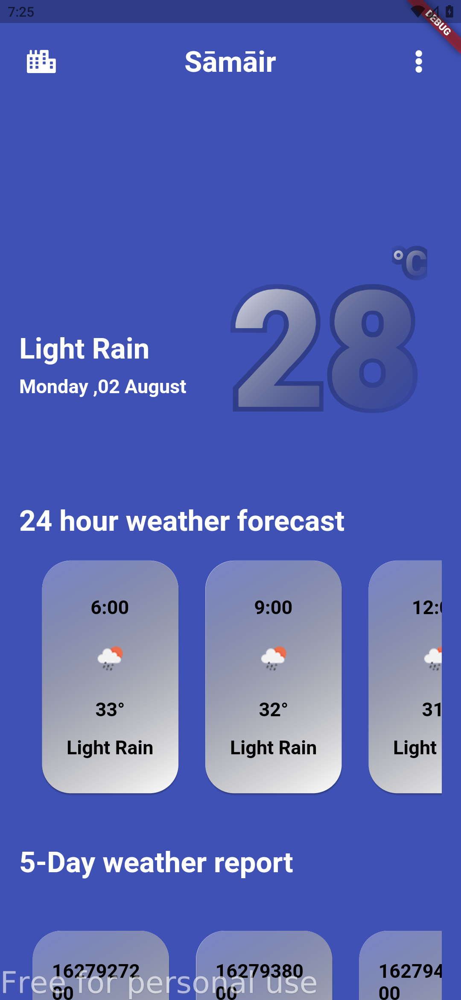
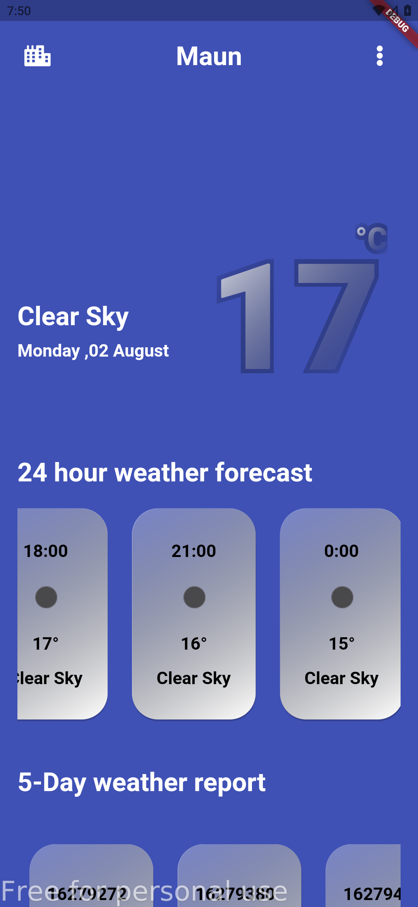

# Simple Weather App

This is a simple weather application that retrieves weather information based on your location. The UI was inspired by Jayesh Borda[Weather App Ui](http://www.uplabs.com/posts/weather-app-ui-concept-b899e319-7180-4747-ad0f-63b7920f9f98).

Below are screenshots of the app.

### API used from OpenWeather [OpenWeather](https://openweathermap.org/)

## Getting Started

This project is a starting point for a Flutter application.

A few resources to get you started if this is your first Flutter project:

- [Lab: Write your first Flutter app](https://flutter.dev/docs/get-started/codelab)
- [Cookbook: Useful Flutter samples](https://flutter.dev/docs/cookbook)

For help getting started with Flutter, view our
[online documentation](https://flutter.dev/docs), which offers tutorials,
samples, guidance on mobile development, and a full API reference.
